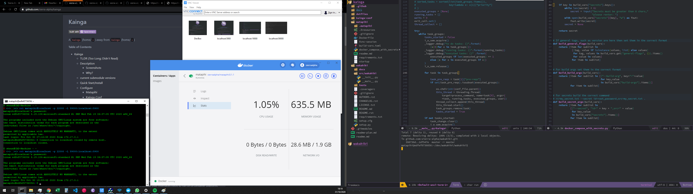
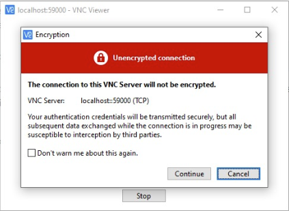
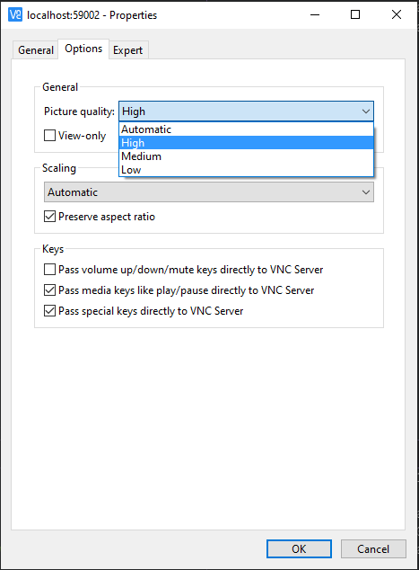
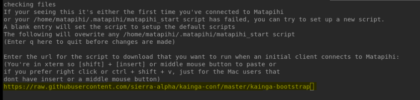
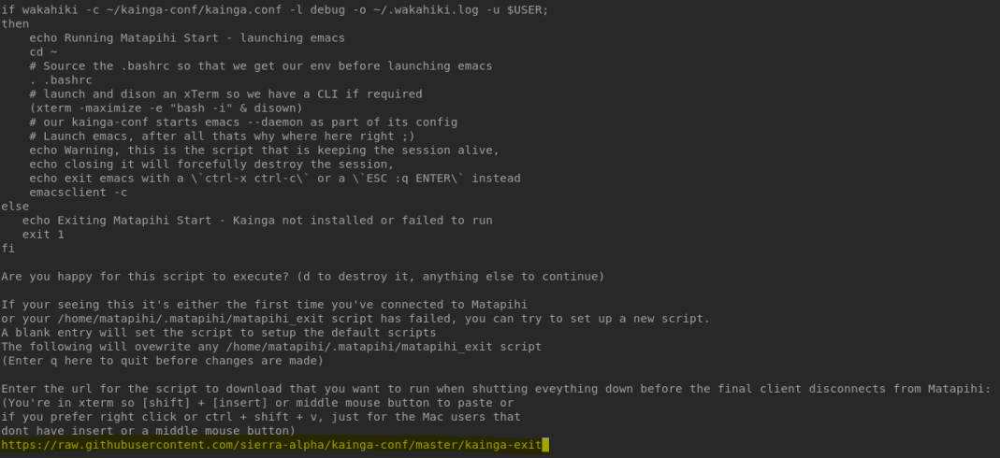

# Kainga
[](http://spacemacs.org)

A `kainga` (home/`~`) away from `kainga` (home/`~`)

<!-- markdown-toc start - Don't edit this section. Run M-x markdown-toc-refresh-toc -->
**Table of Contents**

- [Kainga](#kainga)
    - [TL;DR (Too Long; Didn't Read)](#tldr-too-long-didnt-read)
    - [Description](#description)
        - [Screenshots](#screenshots)
        - [Why?](#why)
    - [current submodule versions](#current-submodule-versions)
    - [Quick Start/Install](#quick-startinstall)
    - [Configure](#configure)
        - [Matapihi](#matapihi)
        - [Kainga-Conf](#kainga-conf)
        - [Wakahiki](#wakahiki)
        - [Security](#security)
    - [Use Cases](#use-cases)
    - [Features](#features)
    - [Known Bugs/improvements](#known-bugsimprovements)
    - [More Info](#more-info)
    - [Licence](#licence)
    - [Contributing](#contributing)

<!-- markdown-toc end -->

## TL;DR (Too Long; Didn't Read)

A containerised Xserver with VNC over SSH tunnels. Launching a Spacemacs editor
with a preferred setup.


## Description

Kainga is the Te Reo Moari word for home, it's purpose is to let you feel at
home wherever you may be, it is implemented as follows.

Kainga is a way of setting up containerised Xserver and virtual network
computing (VNC) connections over a Secure Shell (SSH) tunnel. This allows
applications that require Graphical User Interfaces (GUI) to run on a container
platform, in this case Docker, and be accessible over a VNC viewer through a SSH
tunnel.

This implementation uses Docker for the containerisation, this part is named
`matapihi`, the Te Reo Moari word for window, as it is the window into the
house, home or `~`. The container uses Xvnc to start the Xserver and provide
the VNC server.

Next once SSH'd into the container and port forwarding to the containers 5900
(VNC) port, you then access the container through a VNC viewer. At this point
the matapihi init will be launched where you can add urls to scripts to run at
the initial VNC client connection, also available is an exit script for tearing
down an environment when the VNC exits.

The script provided in the matapihi init needs to call some application to run
in the foreground else the script will finish and cause the Xserver to prompt
for exiting.

In `kainga`'s use of matapihi we run a script hosted in my `kainga-conf`
repo that installs `wakahiki` (The Te Reo Moari word for crane, as it picks up
the scripts and builds the container with them) which reads from the
kainga-conf file in the kainga-conf repo and then sets up the environment
and launches spacemacs when ready.

### Screenshots


Left screen this repo on GH, the ssh tunnel in windows bash, the Vnc Viewer main screen
docker dash board showing the stats for the container.
Right screen the container running spacemacs viewed through the vnc viewer.


### Why?

Sick of having to modify my IDE or editor for programming depending on what
machine I was on, I searched for a method to be able to recreate the same
environment across all machines, virtual machines were one option, but heavy and
resource intensive. Research into containerisation showed that it seemed a
Docker container that could run on all machines, this container could house the emacs/spacemeacs 
configuration that suited me, was the answer. There were some initial hurdles,
such as getting a GUI on a container you can read about the whole process at the
[project report docs](./docs/project-report.md) if you are interested.

## current submodule versions

[dotfiles 0.1.0](https://github.com/sierra-alpha/dotfiles/tree/0.1.0)  
[kainga-conf 0.1.1](https://github.com/sierra-alpha/kainga-conf/tree/0.1.1)  
[matapihi 0.1.2](https://github.com/sierra-alpha/matapihi/tree/0.1.2)  
[wakahiki 0.1.5](https://github.com/sierra-alpha/wakahiki/tree/0.1.5)  

## Quick Start/Install

You: "Ahh you mentioned SSH tunelling, Containerisation, VNC and GUI all in one
sentence up there, I just want what you have without the hassle!"

Me: "Sure just do this:"

You can get up and runnning using my config and you'll be able to use the system
to get a feel for how you could customise it and use it as your own.

First you'll need to install [Docker](https://docs.docker.com/get-docker/),
once you've done that you can run the container by using the command (note if
you want to easily access your host files see the [matapihi configuration
section](#matapihi)): 

```shell
docker run -d -p 22000:22 --name matapihi sierraalpha/matapihi:0.1.2
```

The -d runs the container in the background and the -p specifies the host port we
want to pass through to the containers SSH port.

Then we should do some security things, open up a terminal of your choice, ssh
into the container with the following:

```shell
ssh -p 22000 matapihi@localhost
```
Follow the prompts using `initial` as the first password to enter the system, it
will ask you to enter the current password `initial` again and then select a new
password, it will then log out of the ssh connection, connect again with the
same command.

Next we'll change the VNC servers password, this will be used when the client
VNC viewer connects to the Xvnc server (through the SSH tunnel):

```shell
vncpasswd
```

Note it's not `password` this is the password for the vnc connection, it is also
set to `initial` by default but you don't need the initial one for resetting it
(because you're already logged in and an authorised user with the SSH
connection).

Then you should do the following to regenerate the SSH keys

** Note if you get disconnected during these commands it's likely to be
   impossible to reconnect through SSH but you can still use docker to get a
   root shell and then run these commands there.

```shell
sudo su
/bin/rm -v /etc/ssh/ssh_host_*
dpkg-reconfigure openssh-server
service ssh restart
exit
exit
```
Now you should exit the SSH connection one more time (if you copy pasted the
above then it should already be done) so that we actually start using the new
keys, when you try and reconnect using the same ssh command:


```shell
ssh -p 22000 matapihi@localhost
```
It will give you an error similar to the following.

```log
@@@@@@@@@@@@@@@@@@@@@@@@@@@@@@@@@@@@@@@@@@@@@@@@@@@@@@@@@@@
@    WARNING: REMOTE HOST IDENTIFICATION HAS CHANGED!     @
@@@@@@@@@@@@@@@@@@@@@@@@@@@@@@@@@@@@@@@@@@@@@@@@@@@@@@@@@@@
IT IS POSSIBLE THAT SOMEONE IS DOING SOMETHING NASTY!
Someone could be eavesdropping on you right now (man-in-the-middle attack)!
It is also possible that a host key has just been changed.
The fingerprint for the ECDSA key sent by the remote host is
SHA256:Somereallylongandweirdlookingsha256keykdkshsije.
Please contact your system administrator.
Add correct host key in /home/<user>/.ssh/known_hosts to get rid of this message.
Offending ECDSA key in /home/<user>/.ssh/known_hosts:X
  remove with:
  ssh-keygen -f "/home/<user>/.ssh/known_hosts" -R "[localhost]:22000"
ECDSA host key for [localhost]:22000 has changed and you have requested strict checking.
Host key verification failed.
```

Don't worry you're the one doing something nasty, just follow it's instructions
on your local (the non container) machine about removing the old keys from the
known host and follow on below and all should be fine.

This time when we reconnect we want to use the port
forwarding aspect of SSH, this is what gives us an encrypted tunnel through to
the VNC server running on the computer.

```shell
ssh -p 22000 matapihi@localhost -L 59000:localhost:5900
```
Now go to your vnc viewer of choice, I'm currently using [Real
VNC](https://www.realvnc.com/en/connect/download/viewer/)  but will
likely switch to [tigervncviewer](https://tigervnc.org/) soon because that is
the client version of the vnc server which is installed in the container and
there is a chance that it handles dynamic screen resizing to the client size,
but I digress...

In your VNC viewer set up a connection to the port we're forwarding to the
containers vnc port of 5900, in this example it's 59000 so:

`localhost:59000`

is the host/ip you want to connect to.

You'll be greeted with an encryption warning, we have encryption to authenticate
the VNC viewer to server connection but not for the session, but thats why we
tunnel over the SSH connection, it encrypts the traffic for us so if you see a
warning like this you can safely click continue (don't show again if you like):



In the password prompt use the password that you used for the `vncpasswd` step
previously

Now you are connected to matapihi the window into the Xserver first if you are
using Real VNC then set the picture quality to high to get the screen to look
good:



So we want to set up the programs that I use, matapihi will prompt for some urls
that point to scripts you want to run on start up, the prompt will look like
this (the highlight is what I've pasted in):



Heres what I use, for the startup script, I paste into the prompt the following:

```shell
https://raw.githubusercontent.com/sierra-alpha/kainga-conf/master/kainga-bootstrap
```

You'll then be asked to review the script to ensure it's what you expected (to
make sure there is nothing nasty going on) that's the top half of this screen
shot, followed by the prompt for the exit script (again the url that I've pasted
in is highlighted)



Then for the exit script I paste in the following (shown in the highlight above)

```shell
https://raw.githubusercontent.com/sierra-alpha/kainga-conf/master/kainga-exit
```

Now matapihi will run through these scripts and install python, pip and git,
then clone my kainga-conf repo and install wakahiki the multithreaded script
loader also part of this collection here. Then it will load all the config as
setout in the kainaga-conf. 

Part of this loading will prompt you to generate and upload an SSH key to GitHub,
you can safely skip this step by passing in a blank user name, and all pulls
will use HTTPS, if you want to upload the key using this script you'll need a 
Personal Access Token with write access to User keys, see the [GitHub Docs](https://docs.github.com/en/free-pro-team@latest/github/authenticating-to-github/creating-a-personal-access-token) for more info

After all that is loaded eventually it will start the emacs server and then
launch emacs and you're in.

Like everything that's good it's best to start it with a restart, (in spacemacs
the mode line won't render properly till we restart) so `ctrl` + `x`, `ctrl` + `c` to
exit emacs which will start terminating matapihi (you might need to exit or alt
tab out of the spare terminal to get to the exit prompt), follow the prompts to
exit. You may even like to restart the docker conatiner, this will free up some
memory for the host as it uses more memory to install than it needs to run, if
you do this you will need to reconnect the SSH tunnel. Then reconnect the VNC
client, this will reload and when emacs starts then it should display 
correctly.

You can navigate to a terminal using `alt` + `tab` or pull one up in emacs by
using `spc` + `'` then check the output 
of the `xrandr` command and chose a resolution of your display that fits best
and change to that size by typing `wnrz <#>` where <#> is the number (starting
from 0) that matches the item in the display list you want to use. (hint if the
screen choice was incorrect and you can no longer see all of the screen to
change it back your vnc viewer likely has a scaling option you can use to see
the whole screen at an incorrect dpi while you play around with and get the
correct size, you can also add resolutions to the xrandr output, see the xrandr
docs for that [here](https://www.x.org/releases/X11R7.5/doc/man/man1/xrandr.1.html))

Happy Hacking!

## Configure

Above we walked you through how to get up and running with my config, but the
idea is for kainga to be your home, not mine so lets walk through how to
configure it. In the interest of seperation of concerns the various aspects that
make up this project have been seperated into their respective repos. You
can read specific guidance at their respective repos listed after each
heading if applicable.

### Matapihi

For an in depth guide to `matapihi` see it's repo
[here](https://github.com/sierra-alpha/matapihi) it's also available to run
directly from Docker Hub
[here](https://hub.docker.com/repository/docker/sierraalpha/matapihi) 

Is basically an SSH server that spins up a default VNC connection on Xdisplay :0
so connection is on it's local host port of 5900 (long term goal is to spin up
different Xservers as new clients connect, raise an issue if you want this
sooner). Customisations here include which port you wish to forward, and which
of your host ports you want to use to connect to the SSH on. You may also like
to mount some of your host drives into the container to be able to work on them
from within the container, this is what I do

```shell
docker run -d -p <host-port-to-use>:22 [--mount type=bind,source=<path/on/host>,target=<path/on/container> --name <container-name>] sierraalpha/matapihi-private:<current-version>
```

 - Everything inside the `[]` are optional
 - `<host-port-to-use>` is any unused ephemeral port, I normally use 22000 as
SSH default is 22 so it's easy to remember
 - `<path/on/host>` is an existing directory on your host that you want the
contaier to be able to access
 - `<path/on/container>` is the path inside the container where you want to access
the host directory above
 - `<container-name>` A name to easily identify this particular container instance
of the `matapihi` image
 - `<current-version>` The current version (see [current submodules for the
 latest](#current-submodule-versions)) of matapihi image to use   

Now that is done the SSH Tunnel has some configurable options too

```shell
ssh [-fNT] -p <host-port-to-use> matapihi@<container-address> -L <host-port-to-fwd>:<container-address>:5900
```

 - `[]` optional values to allow SSH tunnel to go to the background
 - `<host-port-to-use>` the same value as used above
 - `<host-port-to-fwd>` The port on the host that will be forwarded to 5900 (the VNC port) 
   on matapihi, ususally I use 59000
 - `<container-address>` The address of the container, most likely `localhost`, you
can probably use a different address for a machine that isn't the host if the
host is configured to accept incoming connections on the `<host-port-to-use>`
specified earlier although this hasn't been tested yet.

Next matapihi will prompt you for some urls that point to scripts that you want
to download and run, matapihi uses `xterm` for these terminals so pasting is
with the middle mouse button or `shift` + `insert` (also to support my macbook
air with no insert or middle mouse button you can `ctrl` + `shift` + `V` or
right click to paste), which brings us too:

### Kainga-Conf

For an in depth guide to `kainga-conf` see it's repo [here](https://github.com/sierra-alpha/kainga-conf)

The kainga-conf repo contains all the configuration and scripts I want to run
when matapihi loads, I use wakahiki to load all the config, this is
specified in the `kainga-bootstrap` file. But at this point you could load
whatever startup and exit scripts you want to run by similarly hosting them on
an url that `wget` can access from within the container. Similarily you could keep the
bootstrap and exit scripts but just change the kainga-conf file to suit your
needs, the next section on wakahiki details more about the kind of config. 

### Wakahiki

For an in depth guide to `wakahiki` see it's repo
[here](https://github.com/sierra-alpha/wakahiki) its also maintained on pip
[here](https://pypi.org/project/wakahiki/) 

Wakahiki is a multithreaded script loader, it uses the following format to
allow a subprocess shell to be run, it handles a priority arrangement and will
execute in multithreaded fashion where possible.

```toml
[command-group]
    pre-reqs = ["previous-command-group.scripts"]
    [[command-group.scripts]]
        no_wait = true
        prompt = true
        priority = 0
        root = true
        script = ["first", "group", "command"]
    [[command-group.scripts]]
        script = ["second", "group", "command"]
```

 - `[command-group]` (required) is the given name to the group of scripts to run, it is
   also used to to determine pre requisites, you can have multiple sections
   like this
 - `pre-reqs` (optional, default=None) the name of any script groups that should be run before this one,
   optional, if excluded will not depend on any other script groups before
   running but doesn't mean it will be first. At least one group must have no
   pre-req in order for the scripts to start.
 - `[[command-group.scripts]]` (required at least one) this is the sub group,
   allows you to specify order of script running for related subtasks, these are
   not run on multiple threads relative to other commands in the same subgroup
 - `no_wait` (optional, default=false) wakahiki will start the command in the
   background, usefull for launching daemon processes (will ignore this if set
   to run with prompt=true)
 - `prompt` (optional default=false) will run connected to the stdout/stderr and
   stdin so users can interact with the process as need be, processes that prompt
   users may cause the program to stop if this is not set to true.
 - `priority` (optional, default=0)will run the subgroups in this order,
   duplicate values are run in an undefined order amongst themselves but still
   in order relative to other values.
 - `root` (optional default=false) will run a sudo echo command before running
   the supplied command, the supplied commands still need to use sudo as
   required but this is to try and prompt once for many scripts that may require
   it.
 - `script` (required) the scripts you want to run in a format that a python
   `subprocess.run()` would expect to recieve, for example `["bash", "-c",
   "echo", "Hello World"]`

The second group is an example of the minimum required for wakahiki to run the
supplied scripts 

### Security

If you're super security conscious you'll wan't to inspect all the code, checkout
each of the repositories for that, and you may even like to build the Docker
container from from the Docker file, checkout the `matapihi` repo and
specifically the
`docker_compose_with_secrets.py` script which will read a config file and pass
in the relavent passwords using files as arguments rather than paswords as args.


## Use Cases

Okay that's all great and good you say, but what would I use it for? Well as
already mentioned to have a similar environment across machines of differeing
OS's, perhaps you could set up a dev server that you can access from anywhere in
the world or even have a cloud server running that you remote into to do all
your dev work on, right there next to you're deployed web service, imagine that
a cloud dev environment that you could use wherever you have internet.

## Features

As `kainga` stands there are a few features; 
 - using Xvnc as the Xserver and the
VNC server as provided by the package
[tigervnc-standalone-server](https://manpages.debian.org/unstable/tigervnc-standalone-server/Xtigervnc.1.en.html)
in the debian repositories 
 - The [GNU
 emacs](https://www.gnu.org/software/emacs/)/[spacemacs](https://www.spacemacs.org/)
 setup as mentioned above, an [xterm](https://invisible-island.net/xterm/)
 terminal, but you could add a browser such as firefox to complete the environment 
 - There is no window manager, but it uses
   [alttab](https://github.com/sagb/alttab) for switching between windows 
 - [GNU Stow](https://www.gnu.org/software/stow/) to help keep track of dotfiles
 - [gitwatch](https://github.com/gitwatch/gitwatch) to keep track of changes and
   automatically push them to github for the kainga-conf repos and dotfiles repo 
 - [supervisord](http://supervisord.org/) to launch and keep gitwatch running. 
 - And a whole lot of hand made scripts to run through `matapihi` & `kainga-conf`

## Known Bugs/improvements

 - When opening a new Xwindow application it doesn't get focus unless you use
   alt tab even though it's the window on top, the workaround for now is to use
   alttab to get focus, (even clicking on the top window doesn't get keyboard
   focus) There's probably some Xserver settings for matapihi or in alttab to
   deal with this.
 - I'd like to have some sort of SSH server listening for connections and then
   launching new Xvnc instances with different display numbers depending on the
   port connected to, this would allow a single instance to support multiple
   connections to do different work simultaneously, but this may be overkill as
   in the docker world you could just spin up another box and fwd a different
   port to it's VNC port.

## More Info

If this has interested you and you want to know more you can see the [project
report](./docs/project-report.md) which details the journey and why decisions
were made for various aspects of the project. 

## Licence

It is intended that as much as possible is released under GPL3, see licenses.md
for more info, this does not overide any underlying works that have different
licences their original licences shall still apply to their works (But I think
everything is GPL3 anyway)

## Contributing

Checkout the [sponsor](https://github.com/sponsors/sierra-alpha) section of my
github profile or raise an issue or submit a PR, thanks for reading and I hope
you enjoy! 

Massive thank you to [@BelkinJr](https://github.com/BelkinJr) for help with the
testing and documentation readability.
